# DeepSeek V4 DSpark 设计文档

本文梳理 Huiying 相关 DSpark 提交在当前代码中的最终实现，说明每类改动的作用，
并介绍 DSpark 在 vLLM Ascend 中的框架接入、模型执行流程、cache 管理和图模式流程。

当前 git 历史里同一批 DSpark 改动同时出现过 `huiyingchen` 和 `huiying` 两个作者名，
部分提交也因为 rebase 或分支合入出现了同主题的重复 hash。本文以当前 HEAD 代码为
准，对重复主题只解释一次。

## 提交改动总览

| 提交 | 改动主题 | 主要文件 | 作用 |
| --- | --- | --- | --- |
| `6aaed00e3` | `refactor(dspark): extract shared utilities and add DSpark model support` | `deepseek_v4.py`, `patch_speculative_config.py` | 增加 DSpark 早期接入点，包括 DSpark draft config 改写和 DeepSeek V4 target hidden 收集。 |
| `9bd5cb9ba` | `feat(dspark): add DSpark KV cache infrastructure` | `acl_graph.py`, Mooncake connector, KV cache utils, model registry | 增加 DSpark draft SWA cache 所需的 KV-cache 分组、图捕获和 PD transfer 基础设施。 |
| `cbfca2083` | `feat(dspark): add DSpark spec-decode base infrastructure` | `spec_decode/__init__.py`, `llm_base_proposer.py` | 扩展 speculative decoding 基类，使 DSpark 能作为 parallel drafter 接入 vLLM rejector。 |
| `5f9d91d21` | `feat(dspark): add DeepSeek V4 DSpark draft model` | `deepseek_v4_dspark.py` | 新增 DSpark draft model、DSpark attention、Markov head、权重映射和 context KV 预计算。 |
| `45438a04f` | `feat(dspark): add AscendDSparkProposer spec-decode proposer` | `dspark_proposer.py` | 新增 DSpark proposer，负责构造 draft 输入、管理 request slot、运行 draft model 并返回 draft token block。 |
| `81918324c` | `feat(dspark): integrate DSpark proposer into model runner` | `model_runner_v1.py`, `llm_base_proposer.py` | 将 DSpark metadata 接到 runner，选择正确 KV cache group，并初始化 draft graph key。 |
| `6b30b4c07` | `refactor(dspark): centralize config detection` | `utils.py`, 多个 DSpark 调用点 | 新增 `is_dspark_config()`，统一 spec config、proposer 选择和 PD transfer 的 DSpark 判断。 |
| `09743ecd3` | `fix(dspark): honor draft eager mode` | `dspark_proposer.py` | 当 speculative config 要求 eager 时，禁用 DSpark draft 编译和 CUDAGraph。 |
| `9185b7657` | `refactor(dspark): remove redundant argument handling` | `deepseek_v4_dspark.py`, `dspark_proposer.py`, `llm_base_proposer.py` | 在接口稳定后删除冗余参数处理，简化 DSpark forward/proposer 链路。 |
| `493fcf609` | `fix(dspark): prepare fused attention metadata before graph` | `deepseek_v4_dspark.py`, `dspark_proposer.py` | 在图捕获/回放前准备 DSpark fused attention metadata，保证 forward 时 metadata 可用。 |
| `ebb6ff952` | `fix(dspark): keep shared-kv metadata outside compiled graph` | `deepseek_v4_dspark.py`, `dspark_proposer.py` | 将 fused shared-KV metadata 放到 forward context，避免作为普通 compiled graph 输入。 |
| `f87a9a4b3` | `fix(dspark): use valid context lengths for cache bounds` | `dspark_proposer.py` | 使用剔除 rejected draft token 后的最后一个有效 target position 约束 paged-cache 访问范围。 |
| `cc67e04bf` | `perf(dspark): remove KV QDQ emulation` | `deepseek_v4_dspark.py` | 删除 KV quant-dequant 仿真逻辑，让 DSpark SWA cache 保持 fused attention 期望的数据格式。 |
| `6daceec09` | `perf(dspark): reuse decode metadata across layers` | `deepseek_v4_dspark.py`, `dspark_proposer.py` | 新增 `DSparkDecodeMetadata`，在多个 DSpark draft layer 间复用 RoPE 和 window metadata。 |
| `2cf9932a1` | `feat(dspark): add fused shared-kv attention` | `deepseek_v4_dspark.py` | 注册并调用 `npu_sparse_attn_sharedkv` 自定义算子，作为 DSpark attention 核心算子。 |
| `62441f795` | `fix(dspark): validate supported device during initialization` | `deepseek_v4.py`, `deepseek_v4_dspark.py`, `dspark_proposer.py` | 增加 A5 设备校验和 DSpark 初始化日志，避免在 A3 等不支持环境中延后失败。 |
| `4a80ac733` | `perf(dspark): batch sampling seed transfer` | `dspark_proposer.py` | fallback sampling seed 先在 CPU 批量构造，再一次 copy 到 NPU buffer，减少小粒度 H2D 写入。 |
| `fd2efa039` | `fix(dspark): derive draft layers from config` | Mooncake connector, KV transfer utils, `deepseek_v4_dspark.py` | DSpark draft layer 数改为来自 `dspark_target_layer_ids`，不再依赖固定常量。 |
| `b4382c720` | `refactor(dspark): remove unused confidence head` | `deepseek_v4_dspark.py`, `dspark_proposer.py` | 删除未完成调测的 confidence truncation 路径，不再要求 confidence head 权重。 |
| `f831e341b` | `perf(dspark): use in-place partial RoPE` | `deepseek_v4_dspark.py` | 使用 `inplace_partial_rotary_mul` 替换 `split + rope + cat`，用于 Q、shared KV 和输出逆 RoPE。 |
| `45c71676d` | `refactor(dspark): remove redundant linear wrapper` | `deepseek_v4_dspark.py`, `dspark_proposer.py` | 删除 `_linear_output` 防御性 wrapper，直接调用已设置 `return_bias=False` 的 linear 层。 |

同主题的重复历史提交包括 `71d62cc2e`、`62627c6f3`、`bd8716106`、`89a45f60a`、
`1f16db1ff`、`27634ac37`、`bf0348072`、`0cf1d948d` 和 `e4b32ba69`。这些提交
与上表中对应主题的逻辑相同，本文不重复展开。

## 配置识别和模型注册

DSpark 的统一开关是 `vllm_ascend/utils.py` 中的 `is_dspark_config()`。该函数会
逐层展开 `VllmConfig`、`SpeculativeConfig`、`ModelConfig` 和 HF config，最终用
`dspark_block_size` 是否为真判断当前 draft config 是否启用 DSpark。

`vllm_ascend/patch/platform/patch_speculative_config.py` 在 speculative config 初始化
阶段改写 DeepSeek V4 DSpark draft config：

| 字段 | DSpark 改写值 | 原因 |
| --- | --- | --- |
| `model_type` | `deepseek_mtp` | 复用 vLLM 已有 MTP speculative model 框架。 |
| `n_predict` | `dspark_block_size` | 将 DSpark block size 映射为 vLLM draft token 数。 |
| `ptd_token_id` | `dspark_noise_token_id` | 作为 parallel draft slot 的 noise/filler token。 |
| `architectures` | `DeepSeekV4DSparkMTPModel` | 让模型注册表加载 Ascend DSpark draft model。 |

`SpeculativeConfig.__post_init__` 还会把 DSpark 标记为 `parallel_drafting`，并把
`enforce_eager` 透传给 draft model config。模型注册位于 `vllm_ascend/models/__init__.py`，
将 `DeepSeekV4DSparkMTPModel` 注册到 `DeepSeekV4DSparkMTP` 实现。

spec decode 方法选择位于 `vllm_ascend/spec_decode/__init__.py`：当 method 是 `mtp` 且
`is_dspark_config(vllm_config)` 为真时，返回 `AscendDSparkProposer`；否则继续使用
普通 MTP/Eagle 路径。

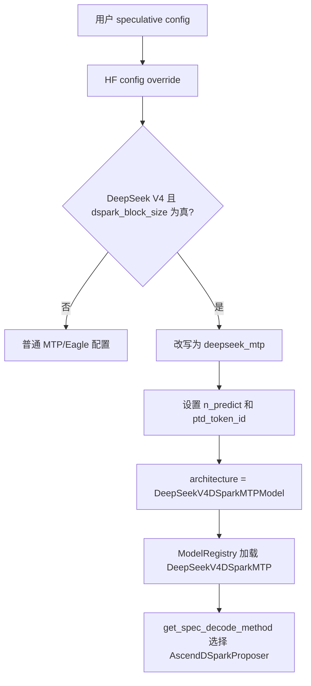

## 整体框架

DSpark 在本仓中不是单独的推理引擎，而是 vLLM speculative decoding 的一种 drafter。
target model 仍然是普通 `AscendDeepseekV4ForCausalLM`。DSpark draft model 消费 target
model 中若干指定层的 hidden states，一次 forward 生成一个 draft block，再交给 vLLM
已有 rejector 用 target 概率验证。

| 组件 | 文件 | 职责 |
| --- | --- | --- |
| 配置检测 | `vllm_ascend/utils.py` | 统一判断 config 是否启用 DSpark。 |
| speculative config patch | `patch_speculative_config.py` | 将 DSpark HF config 转成 vLLM 兼容的 MTP draft config。 |
| target hidden 收集 | `deepseek_v4.py` | 在 target forward 中收集 `dspark_target_layer_ids` 指定层 hidden。 |
| draft model | `deepseek_v4_dspark.py` | 实现 DSpark layer、attention、Markov head、logits 和权重加载。 |
| proposer | `dspark_proposer.py` | 构造 draft 输入、管理 request slot/cache metadata、运行 draft model、采样 draft token。 |
| runner 集成 | `model_runner_v1.py` | 选择 DSpark common attention metadata，初始化 graph/capture 参数。 |
| KV transfer | Mooncake connector | 在 PD 场景中按 DSpark draft layer 数转移 cache。 |
| KV cache 分组 | `patch_kv_cache_utils.py` | 允许 DSpark transferable SWA cache pages 进入 hybrid MLA/SWA cache 分组。 |

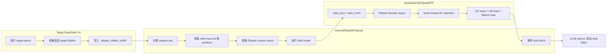

## 模块与函数导读

如果你第一次看这段代码，建议先按下面的顺序读：

1. `utils.py` 里的 `is_dspark_config()`，先知道系统怎么判断自己是不是在跑 DSpark。
2. `patch_speculative_config.py` 里的 `hf_config_override()`，看 DSpark 是怎么被改写成 vLLM 可用的 speculative config。
3. `deepseek_v4.py` 里的 `get_mtp_target_hidden_states()`，看 target model 如何把给 draft model 用的 hidden state 存起来。
4. `deepseek_v4_dspark.py` 里的 `DeepseekV4DSparkModel` 和 `DeepseekV4DSparkAttention`，这是 DSpark 真正干活的核心。
5. `dspark_proposer.py` 里的 `AscendDSparkProposer._propose()`，这是 DSpark 从 target hidden 到 draft token 的总入口。
6. `model_runner_v1.py` 里的 DSpark 特判，理解 runner 怎么把 metadata 喂给 proposer。

### `utils.py`

#### `is_dspark_config(config)`

这个函数只做一件事：判断某个 config 是否启用了 DSpark。

它会依次拆开 `VllmConfig`、`SpeculativeConfig`、`draft_model_config` 和 HF config，最后检查
`dspark_block_size`。只要这个值是正数，就认为这是 DSpark。

为什么要单独做这个函数：

1. DSpark 的 config 会被很多层 wrapper 包裹。
2. 如果每个地方都自己判断，后面会出现“有的地方看到了 DSpark，有的地方没看到”的分叉。
3. 把判断收口到一个函数里，后续改 config 结构时只要改这里。

### `patch_speculative_config.py`

#### `hf_config_override(hf_config)`

这是 speculative config 初始化时的改写入口。

它的作用不是“生成一个新模型”，而是把 DSpark 的 HF 配置翻译成 vLLM 已经认识的
speculative decoding 配置：

1. 识别 DeepSeek V4 DSpark。
2. 把 `model_type` 改成 `deepseek_mtp`。
3. 把 `n_predict` 改成 DSpark block size。
4. 给出 `DeepSeekV4DSparkMTPModel` 这个 architecture 名字。

这样做的目的很直接：尽量复用现有 MTP 推理路径，而不是再造一套新的 speculative 框架。

#### `_dspark_post_init(self)`

这是 `SpeculativeConfig.__post_init__` 的补丁。

它会在 speculative config 初始化后再补两件事：

1. 如果 draft model 是 DSpark，就把 `parallel_drafting` 打开。
2. 如果外层显式要求 eager，就把 `draft_model_config.enforce_eager` 也设成 true。

这保证 DSpark 的 draft 路径和上层 spec config 一致，不会出现外层想 eager、内层还继续 graph compile 的情况。

### `deepseek_v4.py`

#### `AscendDeepseekV4SWACache.get_kv_cache_spec()`

这个函数决定 SWA cache 在 KV cache manager 里应该长什么样。

普通 DeepSeek V4 在 A5 上会走 float8 cache 和扩展后的 head size，但 DSpark 的 cache
不是这个用途。DSpark 这里把 `is_dspark_cache` 打开后，会保留 model dtype 和原始 head size，
因为它要存的是 transferable 的 DSpark context KV，不是 target model 的压缩 cache。

#### `DeepseekV4ForCausalLM.forward()` 里的 DSpark hidden 收集

这段是 target model 侧最重要的 DSpark 逻辑之一：

1. 跑 target layer。
2. 遇到 DSpark 指定层时，把 HC 维度求平均。
3. 把这些层的结果拼起来。
4. 写进 `_dspark_hidden_buffer`。

#### `get_mtp_target_hidden_states()`

这个函数是给 speculative decoding 外部接口用的。

如果当前模型启用了 DSpark，它返回 `_dspark_hidden_buffer`；否则返回普通 MTP buffer。
这就是为什么上层 proposer 不需要知道自己拿的是 MTP 还是 DSpark，只要照旧取 target hidden 就行。

### `deepseek_v4_dspark.py`

这个文件是 DSpark 的核心。

#### 小工具函数

| 函数 | 作用 |
| --- | --- |
| `_get_dspark_sas_op(name)` | 从多个 torch op namespace 里找到 DSpark fused attention 算子。 |
| `_dequant_dspark_wo_a_weight(weight, scale)` | 把 `wo_a` 的分块量化权重反量化回 BF16。 |
| `get_dspark_num_layers(config)` | 从 `dspark_target_layer_ids` 计算 DSpark draft layer 数。 |
| `_apply_dsv4_rope(...)` | 给张量做 DeepSeek V4 RoPE，支持全量和 partial/inverse 两种模式。 |
| `_wo_a_weight_for_eager_projection(...)` | 把 `wo_a` 权重整理成 eager projection 用的形状。 |
| `_grouped_wo_a_projection(...)` | 对分组后的 attention 输出做矩阵乘。 |
| `dspark_sparse_attn_sharedkv(...)` | 真实执行 DSpark fused shared-KV attention 的 custom op wrapper。 |
| `dspark_sparse_attn_sharedkv_fake(...)` | fake impl，给图编译或 shape 推导用。 |

#### `DeepseekV4DSparkAttention`

这是 DSpark attention 的主类，负责“怎么读 cache、怎么做 attention、怎么把结果投回去”。

它包含几个重要方法：

| 方法 | 作用 |
| --- | --- |
| `__init__()` | 准备算子句柄、注册 fused attention metadata cache、创建 DSpark context cache。 |
| `reset_request_slots()` | 清空某些 request slot 的 context cache，避免复用旧请求的数据。 |
| `_get_dspark_kv_cache()` | 找到底层真正绑定的 paged KV cache。 |
| `_project_shared_kv()` | 把 hidden states 投影成 shared KV，并做 partial RoPE。 |
| `precompute_context_kv()` | 把 target hidden 转成 context KV，写入 paged cache。 |
| `sync_context_cache_from_paged()` | 从 paged cache 恢复到 per-request window cache。 |
| `_get_dspark_fused_attention_metadata()` | 生成并缓存 fused attention 所需的 metadata。 |
| `_dspark_attention_from_cache()` | 读取 context KV + draft KV，调用 fused attention 算子。 |
| `forward()` | 把 Q、shared KV、cache 和 attention 算子串起来，输出 attention 结果。 |

你可以把这个类理解成“DSpark attention 引擎”。前半段负责准备输入，后半段负责把
缓存中的上下文和当前 draft token 一起喂给 fused attention。

#### `DeepseekV4DSparkDecoderLayer`

这是 draft layer 的包装层。

它没有重新造一套 decoder 逻辑，而是继承 DeepSeek V4 的 decoder layer，只替换 attention 实现，
让 HC block、MoE、norm 等其他部分继续复用原来的代码。

#### `DSparkMarkovHead`

这是给 sequential sampling 用的 Markov 头。

它做两件事：

1. `embed()`：把 token id 映射成 Markov embedding。
2. `bias()`：把 Markov embedding 变成 logits bias。

采样时，当前 token 的选择会依赖前一个 token，因此每一步都会先算这个 bias。

#### `DeepseekV4DSparkModel`

这是 DSpark draft model 的总封装。

它负责把整个 draft 模型拼起来：

1. 检查设备是否为 A5。
2. 读取 DSpark target layer ids。
3. 构造 draft layers。
4. 准备 `main_proj`、`main_norm`、`norm`、Markov head 和 HC head 参数。
5. 共享 fused attention metadata cache。

关键方法：

| 方法 | 作用 |
| --- | --- |
| `__init__()` | 组装整套 DSpark draft model。 |
| `embed_input_ids()` | 使用 target 的 `embed_tokens` 做输入 embedding。 |
| `precompute_and_store_context_kv()` | 从 target hidden 生成所有 DSpark 层的 context KV。 |
| `reset_request_slots()` | 逐层重置 request slot。 |
| `prepare_fused_attention_metadata()` | 生成当前 batch 的 fused attention metadata。 |
| `sync_context_cache_from_paged()` | 逐层把 paged cache 同步进 window cache。 |
| `forward()` | draft model 前向，输出 draft hidden states。 |
| `compute_head_hidden()` | 把 HC hidden 变成给 LM head 用的 hidden。 |
| `compute_logits()` | 用 shared LM head 算 logits。 |
| `markov_embed()` / `markov_bias()` | 提供采样所需的 Markov 逻辑。 |
| `get_expert_mapping()` | 返回 MoE checkpoint 到 runtime 的映射。 |
| `finalize_mega_moe_weights()` | 权重加载后做 MoE 额外收尾。 |

#### `DeepSeekV4DSparkMTP`

这是给 vLLM 注册的最终模型类。

它的作用更像“壳”：把 `DeepseekV4DSparkModel` 接到 vLLM 的 MTP 模型接口里，并提供
`forward()`、`compute_logits()`、`load_weights()` 这些 vLLM 需要的入口。

重点方法：

| 方法 | 作用 |
| --- | --- |
| `__init__()` | 创建内部 `DeepseekV4DSparkModel`，绑定 shared embed/lm_head。 |
| `set_moe_parameters()` | 从 DSpark layers 提取 MoE 参数。 |
| `forward()` | 把 vLLM 传进来的输入转交给内部 model。 |
| `prepare_fused_attention_metadata()` | 暴露给 proposer 使用。 |
| `compute_logits()` | 走 shared LM head 算 logits。 |
| `precompute_and_store_context_kv()` | 暴露给 proposer，用于 prefill cache 写入。 |
| `reset_request_slots()` | 暴露给 proposer，用于 slot reset。 |
| `load_weights()` | 从 checkpoint 加载 DSpark 权重。 |
| `_map_dspark_weight_name()` | 将 `mtp.*` 权重名映射到 runtime 的 DSpark 层名。 |

### `dspark_proposer.py`

这是 DSpark 从“target hidden”走到“draft token”的总流程入口。

#### 主要方法

| 方法 | 作用 |
| --- | --- |
| `_create_draft_vllm_config()` | 在 eager 模式下关闭 draft 编译和 CUDAGraph。 |
| `__init__()` | 初始化所有 buffer、slot 状态、graph 状态和 sampling 状态。 |
| `_get_graph_runnable()` | 让 graph/replay 调用 DSpark draft runner。 |
| `initialize_cudagraph_keys()` | 根据 target graph capture 结果准备 DSpark graph capture size。 |
| `take_draft_probs()` | 把上一次 draft 的概率按请求顺序取出来。 |
| `_current_req_ids()` | 从 runner 取当前 batch 的 request id。 |
| `_is_kv_consumer()` | 判断当前是否是 KV consumer。 |
| `_register_pd_handoff_warmup()` | 给刚接收到 KV transfer 的请求注册 warmup。 |
| `_consume_pd_handoff_warmup()` | 消耗 warmup 计数，决定是否先返回空 draft。 |
| `initialize_attn_backend()` | 初始化 DSpark attention 的 KV cache group 和 block table。 |
| `dummy_run()` | 图捕获/性能 profiling 时的 dummy forward。 |
| `_update_full_graph_params()` | 在 full graph 下更新运行参数。 |
| `_make_dspark_batch_descriptor()` | 构造 DSpark 专用 BatchDescriptor。 |
| `get_aclgraph_capture_sizes()` | 告诉 runner DSpark 需要哪些 capture size。 |
| `_assign_request_slots()` | 给当前 batch 的 request 分配/回收 cache slot。 |
| `_copy_dspark_block_table()` | 维护稳定地址的 block table buffer。 |
| `set_inputs_first_pass()` | 构造 prefill/decode 的 DSpark 输入。 |
| `_prepare_dspark_window_inputs()` | 生成 context window metadata。 |
| `build_model_inputs_first_pass()` | 给 draft model 构造 forward kwargs。 |
| `_prepare_dspark_fused_attention_metadata()` | 生成 fused shared-KV attention metadata。 |
| `_reset_pending_request_slots()` | 真正调用 model 清空新 slot。 |
| `_prepare_dspark_context_cache()` | 先 reset slot，再写 paged cache，再同步 window cache。 |
| `_pad_dspark_decode_inputs()` | 图模式下补齐输入张量。 |
| `_get_draft_idx_mapping()` | 生成 gumbel sampling 用的 request index 映射。 |
| `_get_runner_idx_mapping()` | 读取 runner 的 request index 映射。 |
| `_get_draft_sampling_temperature()` | 统一取 draft sampling temperature。 |
| `_get_draft_sampling_seeds()` | 统一取 draft sampling seed，fallback 时批量 copy。 |
| `_sample_sequential()` | 核心采样函数，逐 token 加 Markov bias 并采样。 |
| `_truncate_dspark_draft_tokens()` | 裁剪 draft token，并在 probabilistic 模式下保存概率。 |
| `_run_dspark_draft()` | 执行一次完整 DSpark draft forward。 |
| `_propose()` | 对外总入口，拼起输入准备、cache 更新、forward、采样和裁剪。 |

#### `_propose()` 为什么重要

这个函数可以直接理解成 DSpark 的主入口。

它把整个流程串起来：

1. 准备输入。
2. 同步 target 侧 metadata。
3. 准备 context cache。
4. 运行 draft model。
5. 采样 draft token。
6. 返回 proposal 给 vLLM verifier。

如果只想先抓住 DSpark 的“业务主线”，优先看这个函数。

### `model_runner_v1.py`

runner 这边不是 DSpark 的核心实现，但它负责把 DSpark 接到 vLLM 的调度和 graph
系统里。

几个关键位置：

| 位置 | 作用 |
| --- | --- |
| imports | 引入 `AscendDSparkProposer`，让 runner 识别 DSpark drafter。 |
| `num_reqs_padded` 处理 | DSpark mixed-batch 场景下保留 padding，避免 stale value。 |
| `spec_decode_common_attn_metadata` 选择 | DSpark 只在自己的 KV cache group 上接收 common metadata。 |
| `initialize_cudagraph_keys()` | 如果 drafter 是 `AscendDSparkProposer`，也要初始化 draft graph keys。 |
| `set_draft_graph_params()` | ACLGraph 下为 DSpark draft graph 设置 capture sizes。 |

### `patch_kv_cache_utils.py` 和 Mooncake connector

这两块是 cache transfer 侧的配套代码。

| 函数/逻辑 | 作用 |
| --- | --- |
| `get_dspark_num_layers()` | 统一从 `dspark_target_layer_ids` 取 DSpark draft layer 数。 |
| Mooncake connector 的 DSpark 分支 | 在 PD transfer 中把 DSpark draft layer 数传给 connector。 |
| `patch_kv_cache_utils.py` 的 DSpark 分支 | 允许 transferable DSpark SWA cache pages 进入统一 KV cache group。 |

这部分可以理解为：如果没有它们，DSpark 在单机上可能能跑，但一旦进入 KV transfer / PD / hybrid cache
场景，层数、group 和 page bucket 就会对不上。

## 原始 MTP 实现

DSpark 不是从零开始的新框架，它建立在原始 DeepSeek V4 MTP 实现之上。理解原始 MTP
很重要，因为当前 runner、权重加载、图模式和一些通用 proposer 逻辑，很多都还是沿着 MTP
的接口走的。

### 原始 MTP 的核心思路

MTP 的目标是“用前一个 target 结果，去预测后续多个 token”。它的基本方式是：

1. target model 先产出一批 hidden states。
2. drafter 取出这批 hidden states，作为 MTP 输入。
3. 每个 MTP step 复用一个 draft layer。
4. 当前 step 的输出再作为下一个 step 的输入。
5. 最后用 shared head 算 logits，并交给 spec decode 继续验证。

和 DSpark 不同，MTP 不维护专门的 DSpark context cache，也不做 shared-KV fused attention。
它更像“按 step 轮询的多步预测头”，而不是“带单独 context window 的 draft attention 子网络”。

### `deepseek_v4_mtp.py` 的模块和函数

#### `SharedHead`

`SharedHead` 只是一个很轻的容器，里面放了两件事：

1. `RMSNorm`。
2. `ParallelLMHead`。

它的 `forward()` 很简单，只做 norm，不直接产出 logits。真正算 logits 的时候，外部会先经过
`shared_head(hidden_states)`，再把结果送进 `shared_head.head`。

#### `DeepSeekMultiTokenPredictorLayer`

这是原始 MTP 的单步预测层，可以把它理解成“一个 MTP step 的工作单元”。

关键函数：

| 函数 | 作用 |
| --- | --- |
| `__init__()` | 准备当前 step 的投影层、norm、MTP block、HC head 参数和可选 topk buffer。 |
| `forward()` | 把当前 token embedding 和 previous hidden states 组合起来，跑一层 MTP block。 |
| `hc_head()` | 把 HC branch hidden 聚合成最终可用于 logits 的 hidden。 |

`forward()` 的逻辑可以按下面理解：

1. `inputs_embeds` 的 position 0 会被清零，因为这个位置对 MTP 不需要。
2. 当前 token embedding 先经过 `enorm`。
3. `previous_hidden_states` reshape 成 `[batch, hc_mult, hidden_size]` 并经过 `hnorm`。
4. `e_proj(inputs_embeds)` 和 `h_proj(previous_hidden_states)` 相加，形成当前 step 的输入 hidden。
5. 这个 hidden 送入 `mtp_block`。
6. 返回这一层的 hidden states。

这说明 MTP 的输入更像“当前 token + 上一步 hidden 状态”的递推结构，而不是 DSpark 那种“从 target 选定层抽取 hidden，再构造单独的 context cache”。

#### `DeepSeekMultiTokenPredictor`

这是 MTP 的 step 调度器。

| 函数 | 作用 |
| --- | --- |
| `__init__()` | 创建全部 MTP step layers、embedding 和 logits processor。 |
| `embed_input_ids()` | 对外提供 token embedding。 |
| `forward()` | 根据 `spec_step_idx` 选择当前 step layer，并执行一次 MTP step。 |
| `compute_logits()` | 把某个 step 的 hidden states 变成 vocab logits。 |

`spec_step_idx % num_mtp_layers` 决定当前 step 用哪一层。这意味着 MTP 的 draft path 本质上是“按 step 轮换层”，而不是固定一条 DSpark block 内的多层 draft stack。

#### `DeepSeekV4MTP`

这是原始 MTP 的最终对外模型类。

| 函数 | 作用 |
| --- | --- |
| `__init__()` | 组装 MTP predictor，并初始化 MoE 相关参数。 |
| `set_moe_parameters()` | 从 predictor layers 中提取 MoE 结构信息。 |
| `embed_input_ids()` | 暴露 embedding 接口。 |
| `forward()` | 调用内部 predictor 进行 MTP forward。 |
| `compute_logits()` | 计算当前 step 的 logits。 |
| `load_weights()` | 按 DeepSeek MTP checkpoint 规则加载权重。 |
| `_rewrite_spec_layer_name()` | 把 spec layer 的权重名改写成原始模型层名。 |
| `no_mtp_block_in_name()` | 判断某个权重是否属于不带 `mtp_block` 的共享模块。 |

`load_weights()` 是这个类里最重的函数之一，它会处理很多 checkpoint 命名差异：

1. 把 `mtp.*` 的权重名映射到 runtime 的层名。
2. 处理 `w1/w2/w3` 到 `gate_proj/down_proj/up_proj` 的映射。
3. 处理 shared head、norm、token embedding、attention sink 和 MoE expert 权重。
4. 处理 fp8、shared expert、TP rank 切片等加载细节。

如果把它翻译成一句话，就是：**原始 MTP 负责把 checkpoint 里的“多步预测头”正确加载到运行时的 draft model 结构里。**

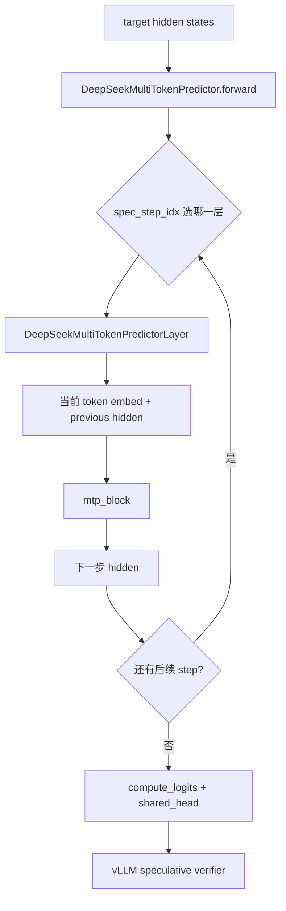

### 原始 MTP 和 DSpark 的框架差异

这部分是最容易看混的地方。两者都属于 speculative decoding，但框架侧重点不同。

| 维度 | 原始 MTP | DSpark |
| --- | --- | --- |
| 输入来源 | target model 的 pre-hc_head residual hidden | target model 选定层 hidden 的拼接结果 |
| draft 组织方式 | 按 `spec_step_idx` 逐 step 轮换 predictor layer | 一次 forward 处理一个完整 draft block |
| attention 形态 | 标准 DeepSeek V4 draft layer 路径 | 自定义 fused shared-KV attention |
| cache 管理 | 没有独立的 DSpark context cache | 有 paged SWA cache + per-request window cache |
| 请求管理 | 主要依赖通用 speculative decoding metadata | 需要 request slot、block table、window index 的额外管理 |
| 图模式 | 走通用 draft model 图路径 | 需要额外准备 fused attention metadata 和 DSpark 专用 capture sizes |
| 采样语义 | 原始 MTP 的 step-based 预测链 | DSpark block 内仍是顺序采样，但 draft block 是并行准备的 |
| 权重命名 | `mtp.{idx}.*` + 原始 MTP layer 结构 | `mtp.{stage_idx}.*` 但 runtime 对应 DSpark 专用模型 |

#### 在当前 runner 里的差别

`model_runner_v1.py` 里有一段统一逻辑：先从 target model 取 `get_mtp_target_hidden_states()`，
再把它交给 drafter。

这个接口对原始 MTP 和 DSpark 都通用，但内容不同：

1. 原始 MTP 返回的是 `_mtp_hidden_buffer`，也就是 pre-hc_head residual。
2. DSpark 返回的是 `_dspark_hidden_buffer`，也就是多个指定 target layer hidden 的拼接结果。

也就是说，runner 只知道“我要给 drafter 一份 target hidden”，但并不知道它到底是 MTP 还是 DSpark。
真正的差异藏在 model 实现里。

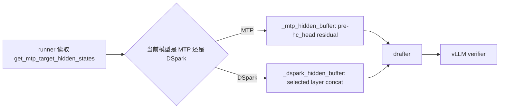

### propose 过程差异

如果只看 `propose` 这一层，原始 MTP 和 DSpark 的差异会更明显。

#### 原始 MTP 的 propose

原始 MTP 的提交流程更像“迭代式驱动器”：

1. 先准备第 0 步输入，通常是 target hidden + 当前 token embedding。
2. 跑一次 draft model，得到第 1 个 draft token。
3. 把上一步生成的 token 和 hidden 再喂回同一个 MTP 逻辑。
4. 重复 `num_speculative_tokens - 1` 次。
5. 每一步都要处理 positions、hidden states、可能的 padding / all-gather / logits gather。

也就是说，原始 MTP 的 core shape 是“逐步循环 + 每步一次模型前向”。

#### DSpark 的 propose

DSpark 的提交流程更像“block orchestration”：

1. 先从 target model 拿到 DSpark hidden buffer。
2. 分配 request slot，构造 block table 和 context window metadata。
3. 把 context KV 预计算到 paged cache，再同步到 per-request window cache。
4. 只跑一次 DSpark draft model forward。
5. 在 `_sample_sequential()` 里把这个 block 内的 token 顺序采样完。

也就是说，DSpark 的 core shape 是“准备一次 block + 一次模型前向 + block 内部顺序采样”。

#### 关键差别总结

| 项目 | 原始 MTP | DSpark |
| --- | --- | --- |
| 模型前向次数 | 每个 speculative step 都可能再跑一次前向 | 一个 proposal block 只跑一次前向 |
| 输入组织 | 复用上一轮 hidden 和 positions，逐步更新 | 一次性构造完整 block 的 input_ids / positions / slot_mapping |
| cache 依赖 | 主要依赖通用 attention metadata | 依赖 paged KV + request-slot window cache |
| metadata 准备 | 通用 `CommonAttentionMetadata`，按 step 更新 | 额外准备 fused shared-KV metadata，且先写 cache 再 forward |
| 采样位置 | 在 propose 循环里逐步得到下一步 token | 在 `_sample_sequential()` 里对整个 block 逐 token 采样 |
| 图模式 | 通用 draft graph / ACLGraph 逻辑 | DSpark 专用 capture size + metadata + cache sync |

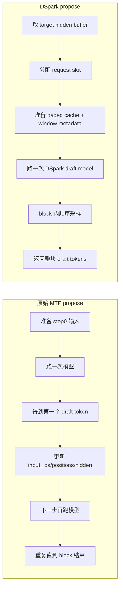

#### 在代码里的对应关系

原始 MTP 主要看 `llm_base_proposer.py` 里的通用 `_propose()`：它先做一次 draft model forward，
然后在 `for draft_index in range(self.num_speculative_tokens - 1)` 里不断更新输入、重新 forward、
重新采样。

DSpark 则在 `dspark_proposer.py` 里走自己的 `_propose()`：它先调用 `set_inputs_first_pass()`，
再调用 `_prepare_dspark_context_cache()` 和 `_prepare_dspark_fused_attention_metadata()`，最后只跑一次
`_run_dspark_draft()`，采样和裁剪都在块级别完成。

所以，**原始 MTP 的 propose 是“循环驱动模型”**，**DSpark 的 propose 是“围绕一个 draft block
做一次性编排”**。

## Target Hidden 收集流程

DeepSeek V4 target model 会读取 `dspark_target_layer_ids`，并为 DSpark 分配
`_dspark_hidden_buffer`：

```text
[max_num_batched_tokens, len(dspark_target_layer_ids) * hidden_size]
```

target forward 中的处理流程：

1. 正常执行 DeepSeek V4 target layers。
2. 如果当前 `layer.layer_idx` 在 `dspark_target_layer_ids` 中，对该层 hidden 在 HC branch
   维度上做 `mean(dim=1)`，得到 `[num_tokens, hidden_size]`。
3. 将所有目标层 hidden 在最后一维 concat。
4. 如果启用 FlashComm1 sequence parallel，对 concat 后 hidden 做 TP all-gather 并去掉 padding。
5. 将结果 copy 到 `_dspark_hidden_buffer`。

`get_mtp_target_hidden_states()` 在 DSpark 启用时返回 `_dspark_hidden_buffer`；否则返回
普通 MTP 使用的 `_mtp_hidden_buffer`。这样外层 spec decode 仍然走 MTP hidden-state 接口，
但 DSpark 实际拿到的是多个 target layer 的拼接 hidden。

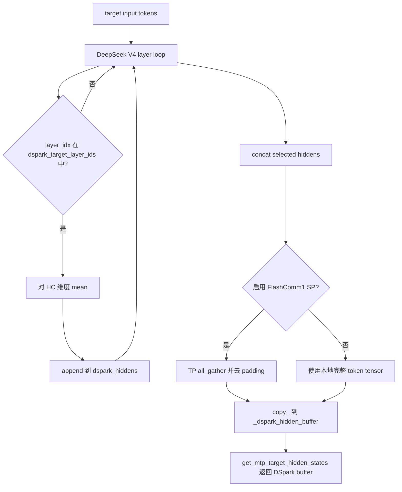

## DSpark Draft Model

DSpark draft model 由 `DeepSeekV4DSparkMTP` 包装 `DeepseekV4DSparkModel` 实现。
初始化时会检查当前设备必须是 Ascend A5，因为该路径依赖 A5 上的 fused shared-KV
attention 和 partial RoPE 算子。

| 模块 | 说明 |
| --- | --- |
| `main_proj` | 将 concat 后的 target hidden 投影回 `hidden_size`。 |
| `main_norm` | 对 projected target hidden 做归一化，用于 context KV 预计算。 |
| `DeepseekV4DSparkDecoderLayer` | 复用 DeepSeek V4 draft layer 结构，但注入 DSpark attention。 |
| `DeepseekV4DSparkAttention` | 投影 Q/shared KV、做 partial RoPE、读取 DSpark context cache、调用 fused shared-KV attention。 |
| `norm` 和 HC head 参数 | 将 HC branch hidden 转成 logits 前 hidden。 |
| `DSparkMarkovHead` | 采样时根据上一个 token 增加 Markov bias。 |
| target `embed_tokens` / `lm_head` | draft model 共享 target embedding 和 LM head，不自己持有权重副本。 |

DSpark draft layer 数由 `get_dspark_num_layers(config)` 读取，最终等于
`len(dspark_target_layer_ids)`。这保证模型构建、Mooncake connector 和 KV transfer 使用同
一个层数来源。

### DSpark Attention

`DeepseekV4DSparkAttention.forward()` 一次处理一个 DSpark draft block。block 长度来自
`dspark_block_size`，也就是 speculative config 中的 `num_speculative_tokens`。

执行步骤：

1. 通过 `wq_a`、`q_norm`、`wq_b` 和 `q_norm_without_weight` 得到 Q。
2. 对 Q 的 `[nope_head_dim, head_dim]` 区间做 in-place partial RoPE。
3. 通过 `wkv` 和 `kv_norm` 得到 shared KV。
4. 对 shared KV 的同一区间做 in-place partial RoPE。
5. 将 token reshape 成 `[batch_size, block_size, ...]`。
6. 根据 request slot 和 window index 从 `_dspark_kv_cache` 读取 sliding-window context KV。
7. concat context KV 和 draft KV，按 page block size padding，并 reshape 成 `PA_BNBD`。
8. 调用 `torch.ops.vllm.dspark_sparse_attn_sharedkv`，底层分发到 `npu_sparse_attn_sharedkv`。
9. 对 attention 输出做 inverse partial RoPE。
10. 执行 grouped `wo_a` projection 和 `wo_b` projection。

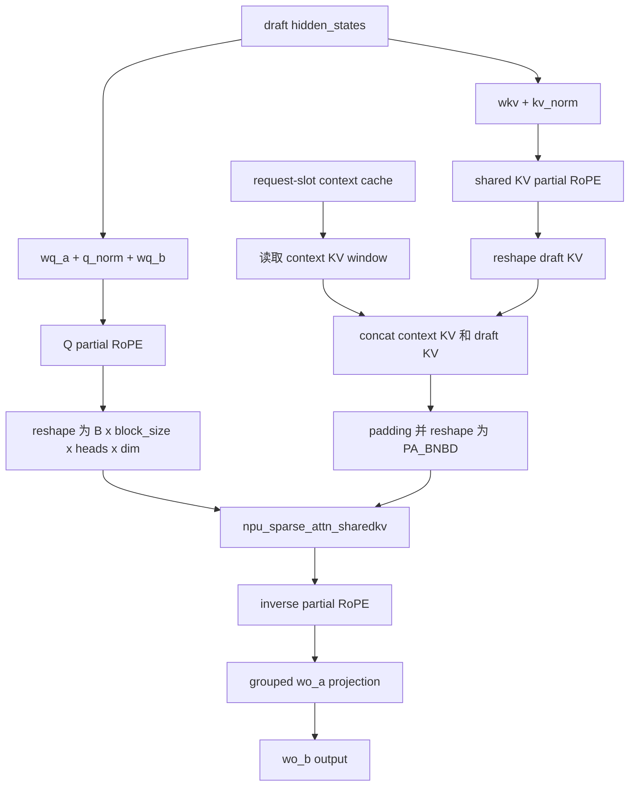

## Proposer 流程

`AscendDSparkProposer` 继承自 `AscendDflashProposer`。原因是二者都消费 target hidden
states，并且都需要构造 parallel draft 输入。DSpark 在其基础上重写了 input、cache、graph
和 sampling 细节。

关键持久 buffer：

| Buffer | 形状 | 作用 |
| --- | --- | --- |
| `hidden_states` / `_dflash_hidden_states` | `[max_num_tokens, hidden_size * num_target_layers]` | 保存 target model 收集的 DSpark hidden。 |
| `input_ids` | `[max_graph_batch_size * block_size]` | draft model 输入 token，第一个 slot 是 target next token，其余是 noise token。 |
| `positions` | 同 `input_ids` | draft token position。 |
| `_slot_mapping_buffer` | 同 `input_ids` | draft token position 对应的 paged KV slot mapping。 |
| `_request_slots_buffer` | 同 `input_ids` | 每个 draft token 对应的 DSpark request cache slot。 |
| `_dspark_block_table_buffer` | `[max_graph_batch_size, max_num_blocks]` | 图模式下稳定地址的 block table。 |
| `_dspark_context_cache_indices_buffer` | `[max_graph_batch_size, window_size]` | 每个请求 context window 在环形 cache 中的 index。 |
| `_dspark_context_cache_valid_buffer` | `[max_graph_batch_size, window_size]` | 标记 context window 中哪些位置有效。 |
| `_dspark_context_request_slots_buffer` | `[max_graph_batch_size, window_size]` | context window 每个位置对应的 request slot。 |
| `_dspark_sampling_seed_buffer` | `[max_graph_batch_size]` | probabilistic sampling fallback 路径复用的 NPU seed buffer。 |
| `_dspark_draft_buffer` | `[max_graph_batch_size, block_size]` | 保存采样得到的 draft tokens。 |

### Prefill 阶段

纯 prefill 阶段 DSpark 不生成 draft token，只准备 context KV，供下一次 decode 读取。

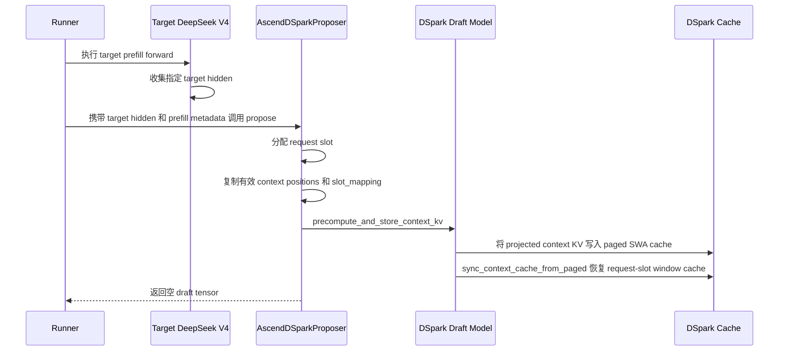

### Decode 阶段

decode 阶段 DSpark 每个 active request 生成一个 draft block。

1. `set_inputs_first_pass()` 为 batch 中每个 request 分配或复用 request slot。
2. 如果有 `num_rejected_tokens_gpu`，从 optimistic query range 中剔除 rejected draft tokens。
3. 用最后一个有效 target position 计算 context length 和 draft positions。
4. 填充 draft inputs：`input_ids[:, 0]` 是 target next token，其余位置是
   `parallel_drafting_token_id`。
5. 根据 target block table 和 draft positions 构造 slot mapping。
6. 改写 common attention metadata，使 draft model 看到 DSpark block 的 query/seq 信息。
7. `_prepare_dspark_context_cache()` 预计算 context KV，并从 paged cache 恢复 per-request window cache。
8. 准备 fused shared-KV attention metadata 并挂到 forward context。
9. 运行 draft model forward。
10. `_sample_sequential()` 按 draft position 逐个采样 token。
11. `_truncate_dspark_draft_tokens()` 返回最终 proposal。confidence head 删除后，正常 decode
    下长度固定为 `num_speculative_tokens`。

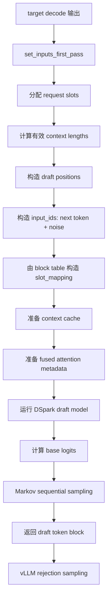

### Sampling 流程

DSpark 支持 greedy 和 probabilistic 两种 draft sampling：

| 模式 | 触发条件 | 行为 |
| --- | --- | --- |
| Greedy | 默认路径或所有请求 greedy | 对 `base_logits + Markov bias` 调用分布式 `greedy_sample()`。 |
| Probabilistic | `draft_sample_method == "probabilistic"` 且不是 all greedy | 调用 `gumbel_sample()`，使用请求 temperature、seed 和 position。 |

draft model 会一次计算所有 draft position 的 base logits，但采样必须逐 token 执行，因为
第 `idx` 个 draft token 的 logits 会加上由上一个 token 产生的 Markov bias。

```mermaid
flowchart LR
    A[draft hidden states] --> B[compute_head_hidden]
    B --> C[compute_logits 得到整个 block 的 base logits]
    C --> D{遍历 block idx}
    D --> E[markov_embed(prev token)]
    E --> F[markov_bias]
    F --> G[base_logits[idx] + bias]
    G --> H{probabilistic?}
    H -- 否 --> I[greedy_sample]
    H -- 是 --> J[gumbel_sample]
    I --> K[写入 draft token]
    J --> K
    K --> D
```

probabilistic 路径会保存 processed draft logits，并在 `_truncate_dspark_draft_tokens()` 中转成
draft probabilities。`take_draft_probs()` 会根据最终 request 顺序取出对应 rows，供 vLLM
verifier 使用。

## Cache 管理

DSpark 同时维护两个 cache 视图：

1. vLLM KV cache manager 管理的 transferable paged SWA cache。
2. 每个 `DeepseekV4DSparkAttention` 自己维护的 per-request sliding-window cache。

paged cache 负责遵守 vLLM block-table 语义、支持 graph mode 和 PD transfer。per-request
window cache 则把 fused attention 需要的 context 压成紧凑的
`[request_slot, window_position, head_dim]`。

### Cache 对象

| Cache | 所有者 | 形状或布局 | 作用 |
| --- | --- | --- | --- |
| SWA paged KV cache | `AscendDeepseekV4SWACache` / KV manager | paged block layout | 按 vLLM block table 存放 DSpark context KV，可用于 PD transfer。 |
| `_dspark_kv_cache` | 每个 DSpark attention layer | `[max_request_slots, window_size, head_dim]` | DSpark fused attention 直接读取的 context window。 |
| `_dspark_cache_positions` | 每个 DSpark attention layer | `[max_request_slots, window_size]` | 记录 cache index 对应的原始 position，用于 reset 和一致性维护。 |
| `_dspark_req_id_to_slot` | proposer | Python dict | 将 request id 映射到稳定 request slot。 |
| `_dspark_free_slots` | proposer | Python list | 保存已释放、可复用的 request slot。 |
| `_dspark_slots_to_reset` | proposer | Python list | 保存本轮新分配、写入前需要 reset 的 slot。 |

### Request Slot 生命周期

`_assign_request_slots()` 每次 propose 都会根据 runner 当前 active request 更新映射：

1. 如果某个 request id 已不在 active batch 中，删除 `_dspark_req_id_to_slot` 记录。
2. 将释放的 slot 放回 `_dspark_free_slots`，并清理该 request 的 PD handoff warmup 状态。
3. 新 request 使用最小的 free slot。
4. 新分配 slot 记录到 `_dspark_slots_to_reset`。
5. `_prepare_dspark_context_cache()` 在写 context KV 前调用 `model.reset_request_slots()` 清零这些 slot。

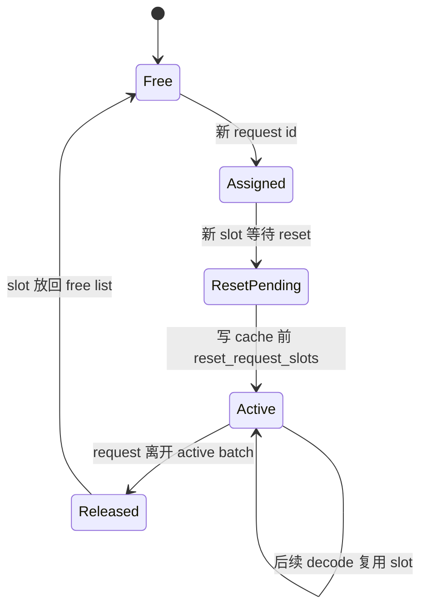

### Prefill Cache 写入和恢复

context KV 写入分两步。

第一步是 `DeepseekV4DSparkModel.precompute_and_store_context_kv()` 负责投影 target hidden：

1. `main_proj` 和 `main_norm` 将 concat target hidden 变成 `hidden_size`。
2. 对安全 context positions 计算 RoPE cos/sin。
3. 每个 DSpark layer 调用 `precompute_context_kv()`。
4. `precompute_context_kv()` 投影 shared KV，并按 `slot_mapping` 写入 paged SWA cache。

第二步是 `sync_context_cache_from_paged()` 从 paged cache 恢复 request-slot window cache：

1. 对每个 request 计算 `[context_end + 1 - window_size, context_end]` 范围。
2. 使用 paged cache block size 将 position 转成 block number 和 block offset。
3. 从 block table gather block id。
4. mask 掉无效 position、无效 block table 项和越界 block id。
5. 从 paged cache 读取 context KV。
6. reset 对应 request slot。
7. 按环形 window index 写入 `_dspark_kv_cache`，并更新 `_dspark_cache_positions`。

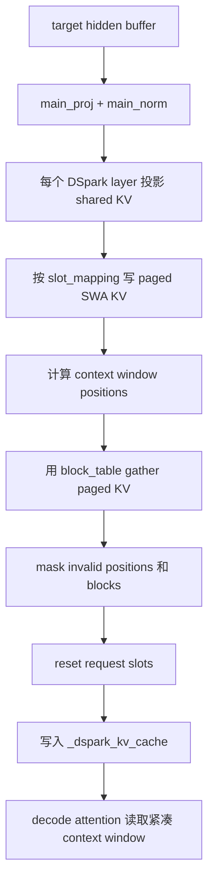

### Decode Window Metadata

`_prepare_dspark_window_inputs()` 会构造图模式友好的稳定 tensor，描述当前 draft block
对应的 context window：

```text
context_end = first_draft_position - 1
context_start = max(context_end + 1 - window_size, 0)
context_positions = context_start + arange(window_size)
cache_indices = context_positions % window_size
cache_valid = context_positions <= context_end
request_slots = request_slot[:, None].expand(-1, window_size)
```

这些 tensor 会封装进 `DSparkDecodeMetadata`，在所有 DSpark draft layers 间复用。
`_dspark_attention_from_cache()` 使用它们 gather context KV。

### KV Cache 分组和 PD Transfer

DSpark 会把 DSA SWA cache layer 标记为 `is_dspark_cache = True`。这会改变
DeepSeek V4 SWA cache spec：

| 普通 DSV4 A5 SWA cache | DSpark SWA cache |
| --- | --- |
| 使用 A5 float8 cache dtype 和扩展后的 cached head size。 | 保持 model dtype 和原始 head size。 |
| 表示 target model DSA cache。 | 表示可转移的 DSpark shared KV context。 |

`patch_kv_cache_utils.py` 允许 DSpark PD 将普通 SWA layer 和 transferable DSpark SWA layer
混在同一个分组场景中。当 page bucket 的 layer count 不一致时，代码会保留整个 SWA group，
让 draft model 仍然共享同一张 block table。

Mooncake connector 在 DSpark 启用时调用 `get_dspark_num_layers(vllm_config)`，保证 PD transfer
的 draft cache layer 数与 `dspark_target_layer_ids` 一致。

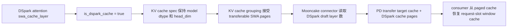

## 图模式和 Metadata

DSpark 支持 eager mode 和 full decode graph mode。以下场景会禁用 draft graph mode：

1. `speculative_config.enforce_eager` 为真。
2. DSpark 使用 probabilistic draft sampling。

图模式下有三个关键约束：

1. DSpark graph 输入 token 数必须是 `block_size` 的整数倍，因为每个 request 固定贡献一个
  完整 draft block。
2. input ids、positions、slot mapping、request slots、block table 和 context-window metadata
  都使用稳定地址 buffer。
3. fused shared-KV attention metadata 在 draft model forward 前挂到
   `forward_context.dspark_fused_attn_metadata`，custom op 从 forward context 读取，不作为普通
   graph tensor 输入。

`initialize_cudagraph_keys()` 会从 target graph capture descriptor 中读取 request 数，将
DSpark draft capture size 设置为 `num_reqs * block_size`。ACL Graph 场景中，
`model_runner_v1.py` 会通过 proposer 提供的 draft capture sizes 调用 `set_draft_graph_params()`。

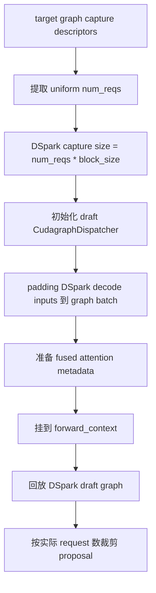

## 权重加载

DSpark checkpoint 使用 `mtp.{stage_idx}.*` 命名。加载时映射到运行时层名：

```text
mtp.{stage_idx}.{suffix}
  -> model.layers.{config.num_hidden_layers + stage_idx}.{suffix}
```

特殊处理如下：

| 权重类型 | 处理方式 |
| --- | --- |
| `embed.weight`, `head.weight` | 跳过，因为 DSpark 共享 target embedding 和 LM head。 |
| `.confidence_head.` | 跳过，因为 confidence truncation 路径已删除。 |
| 最后一个 DSpark layer 上的 `hc_head_*` | 规范化为 model-level HC head 参数。 |
| `wo_a.weight` + `wo_a.scale` | 按 block size 128 dequant 后加载为 eager projection 权重。 |
| stacked MoE 权重 | 通过 `DSV4_STACKED_PARAMS_MAPPING` 加载。 |
| expert 权重 | 通过 DeepSeek V4 expert mapping 加载。 |
| `attn_sink` | 非 DSA CP 场景下按 TP rank 切片加载。 |

loader 会强制要求 `main_proj`、`main_norm`、最终 `norm`、HC head 参数和 Markov head 权重。
缺少这些必要参数会抛出 `ValueError`。

## 端到端流程

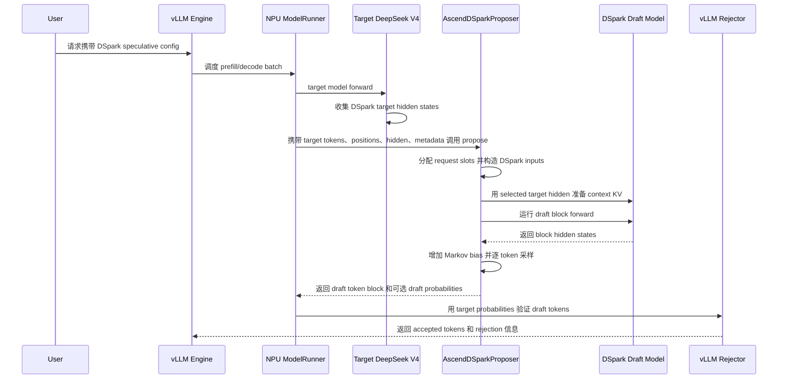

## 关键不变量

当前 DSpark 实现依赖这些不变量：

1. DSpark 只支持 Ascend A5。
2. `dspark_target_layer_ids` 必须是非空 list。
3. DSpark block length 等于 `num_speculative_tokens` 和 `n_predict`。
4. 进入 DSpark draft model 的 decode token 数必须能被 block length 整除。
5. DSpark SWA caches 必须属于同一个 KV cache group。
6. request slot 复用前必须 reset，避免读取旧请求的 context window。
7. context length 必须基于剔除 rejected draft token 后的最后一个有效 target token。
8. fused shared-KV metadata 必须在 draft forward 前准备好，并位于
   `forward_context.dspark_fused_attn_metadata`。
9. probabilistic sampling 当前禁用 DSpark graph mode。

## 后续关注点

当前代码已经实现 DSpark 主流程，但后续优化或 review 仍建议关注：

1. 参考实现中 Q projection 和 KV projection 使用多 NPU stream 重叠，本仓当前 DSpark attention
   仍是串行投影。
2. fused shared-KV attention 存在 heads、head dim、window size、page block size 等硬约束。
   当前已做 A5 设备校验，后续可以补充更明确的 shape/contract 校验。
3. prefill 后第一次 decode 和 PD handoff 后的 context KV 需要持续和参考实现对齐验证。
